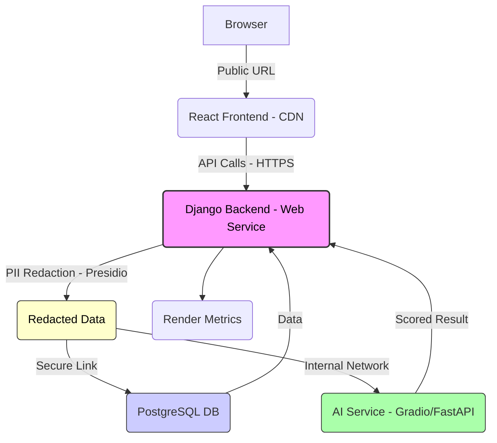

# 🤖 The AI Stack on Render: Simplified Full-Stack Deployment

The transition from development to production for a complex stack—**React (Frontend)**, **Django (Backend)**, and a **Hugging Face AI component**—is streamlined significantly using **Render**. Render’s integrated services, like **Blueprints (render.yaml)**, **PostgreSQL hosting**, and **built-in static site support**, create a powerful, maintainable deployment environment.

***

## 🛡️ I. Data Security and PII Redaction (Critical)

To ensure compliance and protect candidate privacy, **Personally Identifiable Information (PII)** is aggressively redacted before processing by the external AI service and before permanent storage.

### The PII Redaction Workflow

1.  **Ingestion:** The Django Backend receives the full resume file, which contains PII (Name, Email, Address, etc.).
2.  **Extraction:** The text is extracted from the PDF/DOCX file.
3.  **Redaction (The Security Gate):** The Django application uses the **Presidio** library to detect and mask all PII entities (`PERSON`, `EMAIL_ADDRESS`, `PHONE_NUMBER`, etc.).
4.  **Secure Transmission:** The **redacted** resume text is sent to the external AI Service (Hugging Face API). The AI model **never sees** the candidate's name or contact details.
5.  **Secure Storage:** The final `Candidate` record stores the original `name` and `email` for contact purposes, but the stored `resume_text` field contains the **redacted** version, minimizing the PII footprint in the database.

***

## 🏗️ II. Render Deployment Architecture

The core architectural decision is to use Render's various service types to host the three main components independently, with secure, internal networking between them.

| **Component** | **Render Service Type** | **Role in Architecture** | **Key Feature** |
|:---|:---|:---|:---|
| **Frontend** | Static Site | Served globally via Render's CDN. Communicates directly with the public Backend URL. | Built-in CDN for fast loading; Free Tier eligible. |
| **Backend (API)** | Web Service | The main application logic (Django). **Includes PII Redaction logic.** | Auto-scaling and Zero-Downtime Deployment using Gunicorn. |
| **Database** | PostgreSQL | Stores all application data. **Stores redacted resume text.** | Internal Networking; securely linked to the Backend Web Service via the `DATABASE_URL` environment variable. |
| **AI Component** | Web Service (Gradio/Flask/FastAPI) | Handles the computational screening of the **redacted** resume text. | Decoupled scaling—only scale the compute-intensive AI when necessary. |

---

### 🌐 Internal Communication Flow

Browser → Frontend → Backend **(Redaction)** → Database/AI Service

1. **Browser → Frontend:** User accesses the React Static Site URL.
2. **Frontend → Backend:** React (via Axios) calls the public Django API URL (e.g., `https://hr-backend.onrender.com/api/`).
3. **Backend (PII Redaction):** Django receives the resume, extracts the text, and **scrubs all PII** (e.g., "John Doe" becomes `<PERSON>`).
4. **Backend → Database:** Django uses the internally linked, secure `DATABASE_URL` to store the original contact info and the **redacted** resume text.
5. **Backend → AI Service:** Django makes an internal request to the AI Service URL (e.g., `http://ai-service-name.internal/predict`), passing only the **redacted** text.

***

## ⚙️ III. CI/CD Pipeline on Render (The “Blueprint” Workflow)

Render simplifies CI/CD into a **Git-based workflow** managed by the `render.yaml` file (the Blueprint).

### 🧩 Configuration as Code
The entire infrastructure is defined in the `render.yaml` file and committed to Git.

### 🔄 Continuous Deployment (CD)
Once the Blueprint is deployed, Render automatically connects to the Git repository.

### ⚡ Automatic Builds
Whenever you push code to the configured branch (e.g., `main`):

- **Frontend:** Render runs
  `npm install && npm run build`
  and serves the static files via its CDN.
- **Backend:** Render runs
  `pip install -r requirements.txt`
  (including `presidio-analyzer` and `presidio-anonymizer`) then executes the `startCommand`.

### 🧠 Zero-Downtime Updates
Render always deploys new versions on separate infrastructure.
Once the new service passes health checks, it seamlessly replaces the old version, ensuring **continuous uptime**.

***

## 🧪 IV. Testing Strategy for Render Deployment

Testing on Render validates all networked services—especially internal links and environment variables—are functional in production.

---

### 🧰 A. Pre-Deployment Validation

| **Test Type** | **Objective** | **Tool/Method** |
|:---|:---|:---|
| **Blueprint Validation** | Ensure the `render.yaml` syntax is valid. | Render Dashboard (Blueprint creation) or Render CLI. |
| **CORS Check** | Verify React and Django URLs are correctly configured. | Review `CORS_ALLOWED_ORIGINS` in Django settings. |
| **PII Redaction Test** | **(NEW)** Verify redaction logic works outside of the HTTP request. | Use **Django Shell** to run a test function on sample text containing PII. |

---

### 🚀 B. Post-Deployment (Runtime) Testing

#### ✅ Database Connection Test (Integration)
**Goal:** Confirm the Django Web Service connects correctly to PostgreSQL via `DATABASE_URL`.
**Method:** Run a health check or create a test record via Django Admin.

#### 🤖 AI Service Integration Test (Critical)
**Goal:** Ensure the Django Web Service can call the AI Service internally and receives the expected results using **redacted** text.
**Method:** Use Django Shell in Render’s dashboard to run:
```python
import requests
# Ensure the CV text here is REDACTED or dummy non-PII text for testing
response = requests.post("[http://ai-service-name.internal/predict](http://ai-service-name.internal/predict)", json={"cv": "<PERSON> <EMAIL_ADDRESS> <PHONE_NUMBER> Software Engineer"})
print(response.json())
```

#### 🌍 End-to-End (E2E) Test (User Flow)
**Goal:** Validate the full user flow—Frontend → Backend → **Redaction** → Database/AI.
**Method:** Use Playwright or Cypress to submit an application via the public React URL and verify the result.

#### 📊 Performance Check
**Goal:** Monitor AI response time and resource usage, including the overhead added by the PII redaction step.
**Method:** Use Render’s Metrics Dashboard for latency and CPU tracking; adjust autoscaling as needed.

***

## 🧱 V. Deployment & Testing Architecture Overview


*(The Django Backend is the security gate for PII, storing redacted text and only sending redacted data to the AI Service.)*

***

## 🧩 VI. Example render.yaml Blueprint (Simplified)

```yaml
services:
  - type: web
    name: hr-recruitment-backend
    env: python
    buildCommand: "pip install -r requirements.txt"
    startCommand: "python backend/manage.py collectstatic --noinput && python backend/manage.py migrate && gunicorn hr_core.wsgi:application"
    envVars:
      - key: SECRET_KEY
        generateValue: true
      - key: DEBUG
        value: "False"
      - key: CORS_ALLOWED_ORIGINS
        value: "[https://hr-recruitment-frontend.onrender.com](https://hr-recruitment-frontend.onrender.com)"
      - key: HF_SPACE_API_URL
        value: "YOUR_GRADIO_SPACE_API_URL"
        # NOTE: PII is redacted in code, but environment variables like API keys are critical.

  - type: static
    name: hr-recruitment-frontend
    rootDir: frontend
    buildCommand: "npm install && npm run build"
    publishPath: build
    envVars:
      - key: REACT_APP_BACKEND_URL
        value: "[https://hr-recruitment-backend.onrender.com](https://hr-recruitment-backend.onrender.com)"
```
        
***

## 🧭 VII. Summary

**The main security takeaway:** The Django Backend acts as the **Data Security Gateway**, applying PII Redaction before communicating with any external or storage service.

* Frontend (React) → Static Site (Render CDN)
* Backend (Django) → Web Service (Gunicorn + PostgreSQL) **+ PII Redaction**
* Database → Render PostgreSQL with internal networking, **storing redacted content.**
* AI Layer → Separate Web Service (Gradio/FastAPI)
* CI/CD → Git-triggered Blueprints with `render.yaml`
* Testing → Integration, E2E, and performance monitoring with Render Metrics

### 🏁 Deployment Flow

GitHub Push → Render Blueprint → **Build with PII Dependencies** → Auto Build → Zero-Downtime Deploy → Monitoring


> © 2025 Addisu Taye— Full-Stack AI-Powered Recruitment Deployment Guide