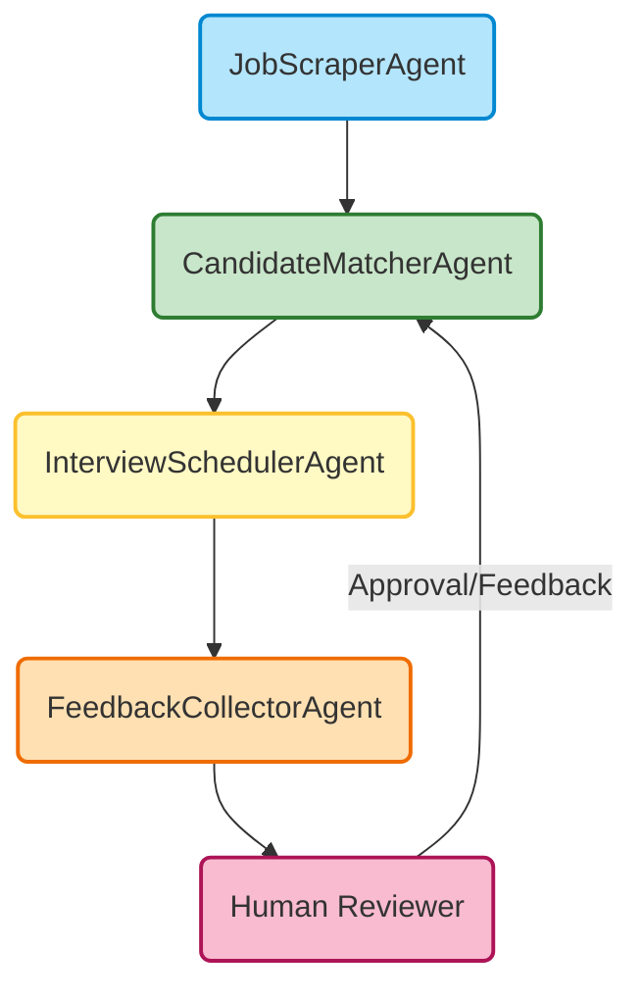
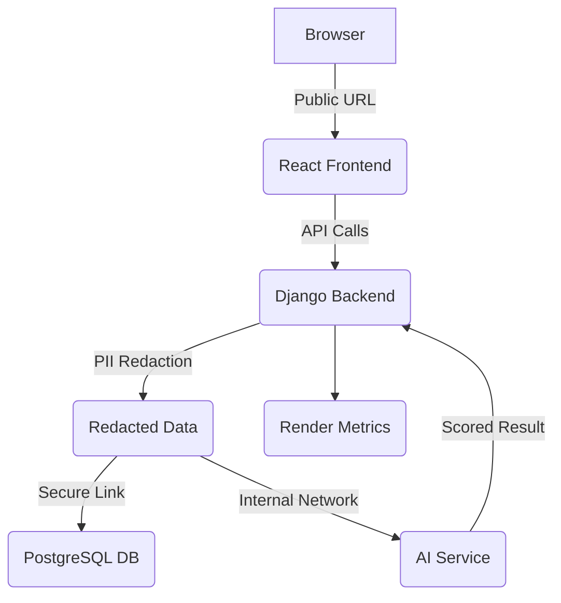

# 🤖 AI-Powered HR Recruitment Agent


An end-to-end **AI-powered HR recruitment system** that automates the entire hiring process — from job posting and intelligent resume screening to candidate ranking and interview scheduling — using 100% free and open-source models.

---

## 🌍 Deployment Targets
- **Hugging Face Spaces** (for demo or light CPU hosting)
- **Render** (for scalable full-stack deployment)

---

## 🌟 Features

### 📋 Job Management
- Create, update, and publish job listings via Django Admin  
- REST API for job data consumption  
- Department and requirement categorization  

### 🤖 AI-Powered Resume Screening
- **Skill Extraction:** Automatically identifies relevant skills from resumes  
- **Experience Analysis:** Extracts years of experience and education  
- **Intelligent Matching:** Compares candidates against job requirements using semantic similarity  
- **PII Redaction:** Automatically detects and redacts sensitive information (SSN, phone numbers, bank accounts)  

### 📊 Candidate Intelligence
- **Match Scoring:** Provides percentage-based compatibility scores  
- **Strength Analysis:** Highlights candidate strengths  
- **Gap Identification:** Identifies missing critical skills  
- **Auto Shortlisting:** Automatically shortlists candidates above 70% match threshold  

### 🖥️ Professional Dashboard
- Real-time analytics and metrics  
- Job-wise application tracking  
- Candidate ranking visualization  
- Responsive React frontend with Tailwind CSS  

### 📧 Automated Workflows
- Email notifications for shortlisted candidates (SendGrid integration)  
- Interview scheduling coordination  
- Background task processing with Django-Q  

---

## 🧩 Agent Roles and LangGraph Workflow

_The diagram below is visible when viewed on GitHub._



### Agent Role Definitions
- **JobScraperAgent:** Collects job postings from LinkedIn, Indeed, or internal APIs.  
- **CandidateMatcherAgent:** Performs semantic matching and ranking based on skills and experience.  
- **InterviewSchedulerAgent:** Automates interview scheduling and sends notifications.  
- **FeedbackCollectorAgent:** Gathers interviewer feedback and updates candidate status.  
- **Human Reviewer:** Provides final validation (Human-in-the-Loop).  

---

## 🛠️ Technology Stack

### Backend
- **Framework:** Django 4.2 + Django REST Framework  
- **AI Orchestration:** LangGraph for stateful workflows  
- **Database:** SQLite (demo) / PostgreSQL (production)  
- **Task Queue:** Django-Q for background processing  

### AI Models (All CPU-Optimized & Free)
- Resume Parsing → `dslim/bert-base-NER`  
- Semantic Matching → `sentence-transformers/all-MiniLM-L6-v2`  
- Insight Generation → `google/flan-t5-small`  
- PII Detection → Custom regex + Presidio integration  

### Frontend
- **Framework:** React 18 + Vite  
- **Styling:** Tailwind CSS + Inter font  
- **Charts:** Chart.js for analytics visualization  
- **HTTP Client:** Axios  

### Deployment
- **Demo:** Hugging Face Spaces (Free Tier)  
- **Production:** Render (Web Service + PostgreSQL + Static CDN)  
- **Containerization:** Docker  

---

## 🚀 Quick Start

### Local Development

```bash
# Clone repo
git clone https://github.com/your-username/hr-recruitment-agent.git
cd hr-recruitment-agent

# Backend Setup
python -m venv venv
source venv/bin/activate  # Linux/Mac
# venv\Scripts\activate  # Windows
pip install -r requirements.txt
python backend/manage.py migrate
python backend/manage.py createsuperuser
python backend/manage.py collectstatic --noinput
python backend/manage.py runserver 8084

# Frontend Setup
cd frontend
npm install
npm start
```

Access the application:  
- **Frontend:** http://localhost:3000  
- **Admin:** http://localhost:8084/admin  
- **API:** http://localhost:8084/api/jobs/

---

## ☁️ Deployment Options

### A. Hugging Face Spaces (Lightweight Demo)

```bash
# Build React frontend
cd frontend
npm run build

# Configure your Space:
# SDK: Docker
# Hardware: CPU Basic
# Secrets:
#   SECRET_KEY=your-django-secret-key
#   DEBUG=False
```

App will deploy at:  
`https://<YOUR_HF_USERNAME>-hr-recruitment-agent.hf.space`

---

### B. Render Full-Stack Deployment (Recommended)

Render simplifies deployment for **React (Frontend)** + **Django (Backend)** + **AI Service (Hugging Face or FastAPI)**.

#### 🏗️ Architecture Overview

| Component | Render Type | Role | Key Features |
|------------|-------------|------|---------------|
| Frontend | Static Site | React interface | CDN-backed, global distribution |
| Backend | Web Service | Django + PII Redaction | Auto-scaling, Gunicorn server |
| Database | PostgreSQL | Persistent storage | Internal networking |
| AI Component | Web Service | AI resume screening | Decoupled compute scaling |

---

### 🔐 PII Redaction Workflow

_The diagram below is visible when viewed on GitHub._



---

## 🧩 CI/CD with Render (Blueprints)

Define infrastructure in `render.yaml`:

```yaml
services:
  - type: web
    name: hr-recruitment-backend
    env: python
    buildCommand: "pip install -r requirements.txt"
    startCommand: "python backend/manage.py collectstatic --noinput && python backend/manage.py migrate && gunicorn hr_core.wsgi:application"
    envVars:
      - key: SECRET_KEY
        generateValue: true
      - key: DEBUG
        value: "False"
      - key: HF_SPACE_API_URL
        value: "YOUR_GRADIO_SPACE_API_URL"

  - type: static
    name: hr-recruitment-frontend
    rootDir: frontend
    buildCommand: "npm install && npm run build"
    publishPath: build
    envVars:
      - key: REACT_APP_BACKEND_URL
        value: "https://hr-recruitment-backend.onrender.com"
```

**Deployment Flow:**  
`Git Push → Render Blueprint → Build → Auto Deploy → Zero-Downtime`

---

## 🧪 Testing Strategy

### Pre-Deployment
| Test | Objective | Tool |
|------|------------|------|
| Blueprint Validation | Validate `render.yaml` syntax | Render Dashboard |
| CORS Check | Verify origin whitelisting | Django settings |
| PII Redaction | Ensure masking works pre-upload | Django Shell |

### Post-Deployment
- ✅ DB Connection Test via Django Admin  
- 🤖 AI Integration Test via Internal Network  
- 🌍 End-to-End Test (Frontend → Backend → Redaction → DB/AI)  
- 📊 Performance Monitor via Render Metrics  

---

## 📜 License

**MIT License © 2025 Addisu Taye Dadi**

Permission is hereby granted, free of charge, to any person obtaining a copy
of this software and associated documentation files (the “Software”), to deal
in the Software without restriction, including without limitation the rights
to use, copy, modify, merge, publish, distribute, sublicense, and/or sell
copies of the Software, and to permit persons to whom the Software is
furnished to do so, subject to the following conditions:

The above copyright notice and this permission notice shall be included in all
copies or substantial portions of the Software.

THE SOFTWARE IS PROVIDED “AS IS”, WITHOUT WARRANTY OF ANY KIND, EXPRESS OR
IMPLIED, INCLUDING BUT NOT LIMITED TO THE WARRANTIES OF MERCHANTABILITY,
FITNESS FOR A PARTICULAR PURPOSE AND NONINFRINGEMENT. IN NO EVENT SHALL THE
AUTHORS OR COPYRIGHT HOLDERS BE LIABLE FOR ANY CLAIM, DAMAGES OR OTHER
LIABILITY, WHETHER IN AN ACTION OF CONTRACT, TORT OR OTHERWISE, ARISING FROM,
OUT OF OR IN CONNECTION WITH THE SOFTWARE OR THE USE OR OTHER DEALINGS IN THE
SOFTWARE.

---

## 🧭 Summary

**Security:** Django acts as the PII gateway, ensuring redacted data only reaches AI.  
**Scalability:** Render supports zero-downtime deployment with modular scaling.  
**Transparency:** Open-source MIT license with clear modular design.  
**Goal:** Ethical, automated, and human-supervised recruitment AI system.  

> © 2025 Addisu Taye Dadi — Full-Stack AI-Powered Recruitment System
